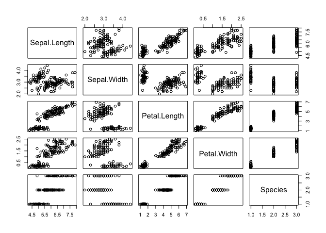
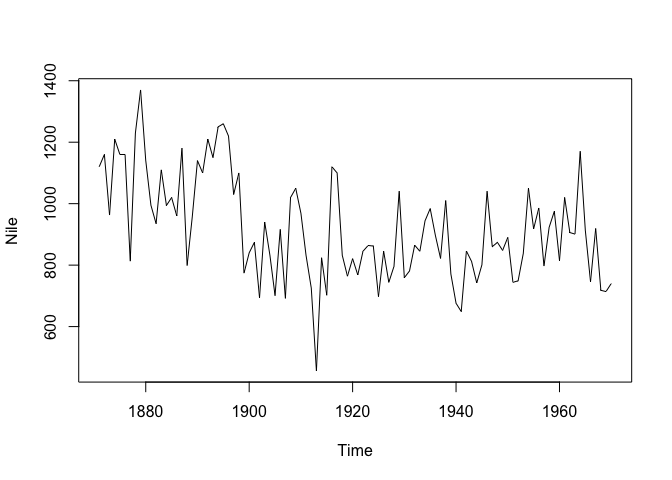
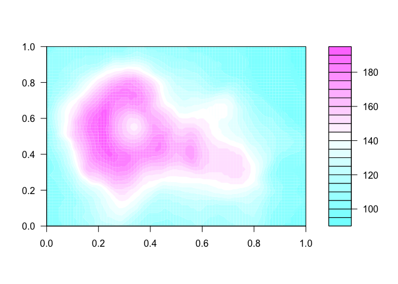
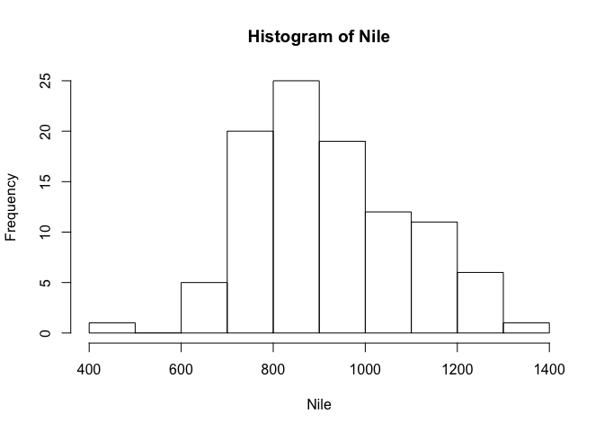
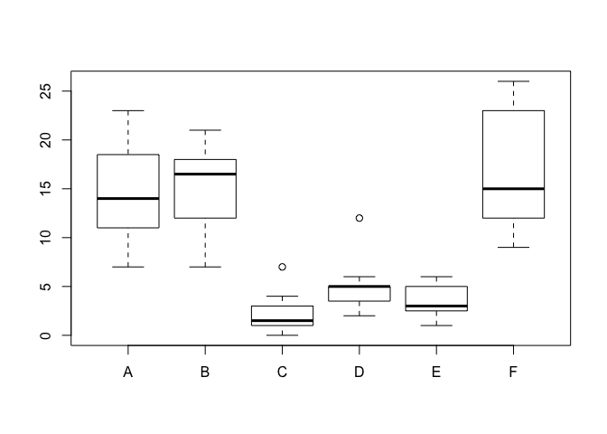

# DREAMR_R
Sejin Park  
2015년 8월 23일  
reproducible research
## helloworld

```r
plot(iris)
```

 

## 시간

```r
str(Nile)
```

```
##  Time-Series [1:100] from 1871 to 1970: 1120 1160 963 1210 1160 1160 813 1230 1370 1140 ...
```

```r
head(Nile)
```

```
## [1] 1120 1160  963 1210 1160 1160
```

```r
plot(Nile)
```

 

## 공간 

```r
str(volcano)
```

```
##  num [1:87, 1:61] 100 101 102 103 104 105 105 106 107 108 ...
```

```r
head(volcano)
```

```
##      [,1] [,2] [,3] [,4] [,5] [,6] [,7] [,8] [,9] [,10] [,11] [,12] [,13]
## [1,]  100  100  101  101  101  101  101  100  100   100   101   101   102
## [2,]  101  101  102  102  102  102  102  101  101   101   102   102   103
## [3,]  102  102  103  103  103  103  103  102  102   102   103   103   104
## [4,]  103  103  104  104  104  104  104  103  103   103   103   104   104
## [5,]  104  104  105  105  105  105  105  104  104   103   104   104   105
## [6,]  105  105  105  106  106  106  106  105  105   104   104   105   105
##      [,14] [,15] [,16] [,17] [,18] [,19] [,20] [,21] [,22] [,23] [,24]
## [1,]   102   102   102   103   104   103   102   101   101   102   103
## [2,]   103   103   103   104   105   104   103   102   102   103   105
## [3,]   104   104   104   105   106   105   104   104   105   106   107
## [4,]   104   105   105   106   107   106   106   106   107   108   110
## [5,]   105   105   106   107   108   108   108   109   110   112   114
## [6,]   106   106   107   109   110   110   112   113   115   116   118
##      [,25] [,26] [,27] [,28] [,29] [,30] [,31] [,32] [,33] [,34] [,35]
## [1,]   104   104   105   107   107   107   108   108   110   110   110
## [2,]   106   106   107   109   110   110   110   110   111   112   113
## [3,]   108   110   111   113   114   115   114   115   116   118   119
## [4,]   111   114   117   118   117   119   120   121   122   124   125
## [5,]   115   118   121   122   121   123   128   131   129   130   131
## [6,]   119   121   124   126   126   129   134   137   137   136   136
##      [,36] [,37] [,38] [,39] [,40] [,41] [,42] [,43] [,44] [,45] [,46]
## [1,]   110   110   110   110   110   108   108   108   107   107   108
## [2,]   114   116   115   114   112   110   110   110   109   108   109
## [3,]   119   121   121   120   118   116   114   112   111   110   110
## [4,]   126   127   127   126   124   122   120   117   116   113   111
## [5,]   131   132   132   131   130   128   126   122   119   115   114
## [6,]   135   136   136   136   135   133   129   126   122   118   116
##      [,47] [,48] [,49] [,50] [,51] [,52] [,53] [,54] [,55] [,56] [,57]
## [1,]   108   108   108   108   107   107   107   107   106   106   105
## [2,]   109   109   109   108   108   108   108   107   107   106   106
## [3,]   110   110   109   109   109   109   108   108   107   107   106
## [4,]   110   110   110   109   109   109   109   108   108   107   107
## [5,]   112   110   110   110   110   110   109   109   108   107   107
## [6,]   115   113   111   110   110   110   110   109   108   108   108
##      [,58] [,59] [,60] [,61]
## [1,]   105   104   104   103
## [2,]   105   105   104   104
## [3,]   106   105   105   104
## [4,]   106   106   105   105
## [5,]   107   106   106   105
## [6,]   107   107   106   106
```

```r
filled.contour(volcano)
```

 

## 분포

```r
?hist
hist(Nile)
```

 

## 관계

```r
plot(cars)
```

 

## 비교 

```r
?InsectSprays
```

X축 : 살충제의 종류
Y축 : 살충제를 뿌리고 남아있는 벌레 수 


```r
str(InsectSprays)
```

```
## 'data.frame':	72 obs. of  2 variables:
##  $ count: num  10 7 20 14 14 12 10 23 17 20 ...
##  $ spray: Factor w/ 6 levels "A","B","C","D",..: 1 1 1 1 1 1 1 1 1 1 ...
```

```r
boxplot(InsectSprays$count ~ InsectSprays$spray)
```

 
  
## 데이터 타입  
데이터의 요소 하나하나가 가지는 속성  

##다섯가지 
- numeric 숫자
- character 문자 
- factor   
- logical   
- NA

## numeric 
integer 

```r
num01 = 1
```

## double

## character

```r
chr01 <- '10'
chr02 <- 'hello world'
chr03 <- '안녕'
```

## factor
범주형 자료 (category)
'a','a','a', 'b','b'는
1,1,1,2,2 : levels "a", "b"
우리 눈에는 문자처럼 보이지만
내부에서는 숫자처럼 계산될 수 있어요. 

## logical 
TRUE/FALSE
T와 F로 줄여쓸 수 있다. 
Numeric 안에 포함시킨 이유는
TRUE + TRUE
를 실행시켜보세요. 
TRUE는 1, FALSE는 0의 값을 가지고 있다. 


```r
sum(T,T,T,F,F)
```

```
## [1] 3
```

## NA는 Not available 을 의미
결측치 Missing Value를 표시한다. 


## 데이터를 담아내는 구조. 

벡터, 행렬, 시계열, 리스트, 데이터 프레임 등
여기서는 벡터와 데이터 프레임만 다룰게요!
  
## vector 

동일한 타입의 데이터를 한 개 이상 저장해둔 형태 
한개도 됩니다. c()로 생성 


```r
vector01 = c(1,2,3,4,5)
vector02 = 1:10
vector03 = c('a','b','c','d')

c(1,2,3,4,5)
```

```
## [1] 1 2 3 4 5
```

```r
c(1,2,3,4,'5')
```

```
## [1] "1" "2" "3" "4" "5"
```

```r
c(1,2,3,4,5.0)
```

```
## [1] 1 2 3 4 5
```

## Vector 
vector[숫자n]

```r
vector01
```

```
## [1] 1 2 3 4 5
```

```r
vector01[3]
```

```
## [1] 3
```

```r
vector01[1:3]
```

```
## [1] 1 2 3
```


```r
vector01[c(T,F,T,F,T)]
```

```
## [1] 1 3 5
```

```r
vector01 > 3  # 조건을 만든다. 
```

```
## [1] FALSE FALSE FALSE  TRUE  TRUE
```

```r
vector01[vector01 > 3]
```

```
## [1] 4 5
```

%% 나머지 연산자. 
벡터[인덱스]

```r
vector01
```

```
## [1] 1 2 3 4 5
```

```r
vector01 %% 2 == 0
```

```
## [1] FALSE  TRUE FALSE  TRUE FALSE
```

```r
vector01[vector01 %% 2 == 0]
```

```
## [1] 2 4
```


vector02 = 1:10 에서 홀수만 출력해보세요. 

```r
vector02 = 1:10
vector02 %% 2
```

```
##  [1] 1 0 1 0 1 0 1 0 1 0
```

```r
as.logical(vector02 %% 2)
```

```
##  [1]  TRUE FALSE  TRUE FALSE  TRUE FALSE  TRUE FALSE  TRUE FALSE
```

```r
vector02[as.logical(vector02 %% 2)]
```

```
## [1] 1 3 5 7 9
```

```r
vector02[vector02 %% 2 ==1]
```

```
## [1] 1 3 5 7 9
```

## data.frame
행과 열의 길이가 일정하고
각 열마다 다른 형태의 자료를 담을 수 있다. 
데이터베이스나 스프레드시트와 유사한 형태를 보인다. 


```r
score_df = data.frame(
  math = c(40, 70, 80),
  korean = c(50,60,70),
  english = c(30,40,50),
  art = c('A','A','C')
)

score_df$math
```

```
## [1] 40 70 80
```

```r
score_df$art
```

```
## [1] A A C
## Levels: A C
```

새로운 열을 만들때는 데이터프레임$새로운열이름 <- 벡터 

```r
score_df$sum = score_df$math +
              score_df$korean +
              score_df$english
```

이름으로 접근 하는 방법. 
데이터를 수정하는 방법. 

6번째 열에 mean이라는 이름으로 국영수의 평균 점수를 넣어보세요. 

```r
score_df$mean    <-   (score_df$sum)/3
score_df
```

```
##   math korean english art sum     mean
## 1   40     50      30   A 120 40.00000
## 2   70     60      40   A 170 56.66667
## 3   80     70      50   C 200 66.66667
```

data.frame[행,열]


```r
score_df
```

```
##   math korean english art sum     mean
## 1   40     50      30   A 120 40.00000
## 2   70     60      40   A 170 56.66667
## 3   80     70      50   C 200 66.66667
```

```r
#2행2열
score_df[2,2]
```

```
## [1] 60
```

```r
# 모든행,2열
score_df[,2]
```

```
## [1] 50 60 70
```

```r
# 2열, 모든행
score_df[2,]
```

```
##   math korean english art sum     mean
## 2   70     60      40   A 170 56.66667
```

```r
score_df[,c(1,3)]
```

```
##   math english
## 1   40      30
## 2   70      40
## 3   80      50
```

```r
# 국어, 미술 열 추출 
score_df[,c('korean','art')]
```

```
##   korean art
## 1     50   A
## 2     60   A
## 3     70   C
```

```r
#수학점수가 50이 넘는 행
score_df[score_df$math > 50, ]
```

```
##   math korean english art sum     mean
## 2   70     60      40   A 170 56.66667
## 3   80     70      50   C 200 66.66667
```


여러분 안녕하세요. 


